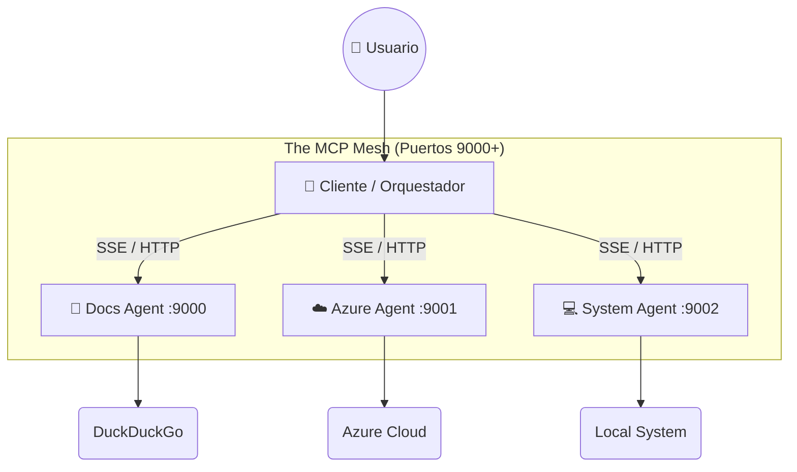

# 🌐 Azure A2A Protocol: Distributed Microservices Mesh

**Arquitectura de Agentes Distribuidos basada en el Protocolo Google A2A (Agent-to-Agent).**

Este proyecto implementa una red de **Microservicios de IA independentes**, donde cada "Agente" es un servidor **FastMCP** completo que expone sus capacidades vía **HTTP/SSE**. Un orquestador central (Cliente) coordina estos servicios para resolver tareas complejas en Azure usando lenguaje natural.

---

## 🏗️ ARQUITECTURA DISTRIBUIDA (Real A2A)

El sistema ya no es un monolito. Ahora consta de **4 Procesos Independientes** que se comunican por red TCP/IP:



| Rol | Puerto | Tecnología | Responsabilidad |
|-----|--------|------------|-----------------|
| **Docs Server** | `9000` | FastMCP | Buscar documentación técnica en la web. |
| **Azure Server** | `9001` | FastMCP | Ejecutar comandos `az cli` y `PowerShell` en la nube. |
| **System Server** | `9002` | FastMCP | Operaciones locales (ping, ficheros, hora). |
| **Orchestrator** | `CLI/Web`| CrewAI | "Cerebro" que decide a qué puerto llamar. |

---

## 🚀 CÓMO EJECUTAR (4 TERMINALES)

Para levantar la "Malla" de agentes, necesitas iniciar cada servidor en su propia terminal.

### 1️⃣ Levantar los Servidores (The Mesh)

**Terminal 1 (Docs Agent):**

```powershell
cd a2aprotocol
.\venv\Scripts\activate
python servers/docs/server.py
# Escuchando en http://localhost:9000/sse
```

**Terminal 2 (Azure Agent):**

```powershell
.\venv\Scripts\activate
python servers/azure/server.py
# Escuchando en http://localhost:9001/sse
```

**Terminal 3 (System Agent):**

```powershell
.\venv\Scripts\activate
python servers/system/server.py
# Escuchando en http://localhost:9002/sse
```

### 2️⃣ Ejecutar el Cliente (The User Interface)

Una vez que los servidores están listos (verás mensajes de log indicando que escuchan en sus puertos), lanza el cliente.

**Terminal 4 (Opción A: CLI Rápido):**

```powershell
.\venv\Scripts\activate
python -m a2a_protocolo_crewai.main
```

**Terminal 4 (Opción B: Web UI con Streamlit):**

```powershell
.\venv\Scripts\activate
streamlit run streamlit_app.py
```

---

## 🧠 FAQ: ¿Es esto el Protocolo A2A?

**SÍ.** Cumple los 3 principios fundamentales:

1. **Desacoplamiento:** Cada agente es un proceso separado. Si el Agente de Azure falla, el de Documentación sigue vivo.
2. **Transporte Estándar:** Usan **HTTP/SSE**, no llamadas de función de Python. Podrías mover el Agente Azure a otra máquina física y cambiar la IP en el cliente.
3. **Interfaz Estándar:** Hablan **MCP (Model Context Protocol)**, el estándar industrial para herramientas de IA.

---

## 📂 ESTRUCTURA DEL PROYECTO

* `servers/` -> Código fuente de los microservicios (Los "Expertos").
* `src/a2a_protocolo_crewai/tools/` -> Clientes ligeros (Stubs) que conectan el Orquestador con los servidores.
* `streamlit_app.py` -> Interfaz gráfica moderna.

## 🔐 REQUISITOS

* **Python 3.10** (Recomendado).
* Archivo `.env` con credenciales de Azure (Service Principal + OpenAI).
* Azure CLI instalado y logueado (`az login`) o SPN configurado.
